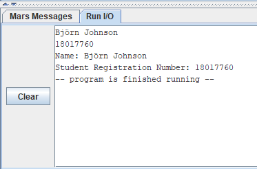
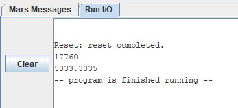
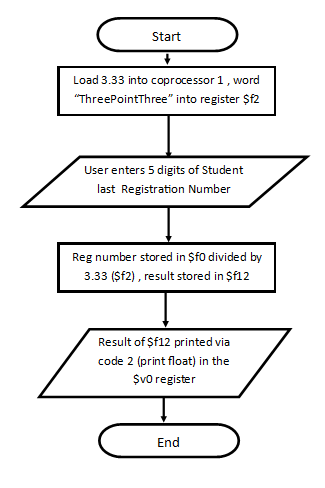
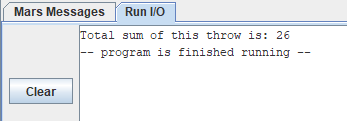
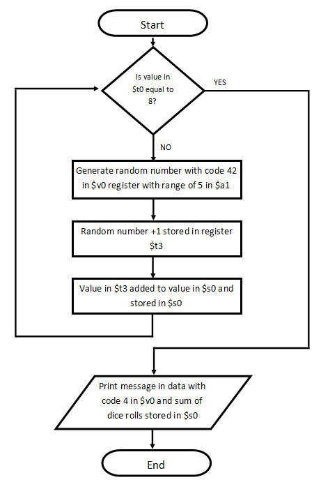

# Assembly-Project
Collection of small assembly tasks written for a university assignment written in the <a href="https://courses.missouristate.edu/KenVollmar/MARS/"> MARS MIPS IDE

### Task 1
This program starts by recieiving both a username and registration number from the input stream, the username has 40 bytes of memory allocated to a space declared in the data section.This ensured potential longer names would supported without risk of an overflow. Once collected the data is printed to the output box along with two stored strings to indicate what the data is for the end user. To collect the data system codes 5 and 8 to are used to read the integer and string respectively then codes 4 and 1 are used to print out the strings and integer.

#### Task 1 Output:

  

### Task 2
Task 2 takes an integer input via the code 5 system code which reads the integer and stores it in memory. Once obtained, the integer value is moved to register t0 since where it is currently stored in v0 will be overwritten by the next system code. The value 0 is added into register t1 via adding the integer value 2 to the $zero constant. The user entered value is divided using the div command and stored in register s0 then added to the a0 register for use in the system call to print the result with code 1 (print integer).

#### Task 2 Output:

  

#### Task 3
MIPs makes use of a separate coprocessor for floating point arithmetic with several extra variables each 32 bits long which are used in groups of two allowing 64 bit representation of the floating point numbers. To make use of this floats have to be loaded into the coprocessor from memory which I made use of via the syntax “lwc1” (load word coprocessor 1). This once passed into the coprocessor showed me a floating point and double representation of the number. I was then able to read in a second floating point number being the last 5 digits of a student registration number for this scenario. Although intended to be an integer value I found it would be easier to load the value straight into the coprocessor as opposed to loading it from the registers. Once both numbers were in the coprocessor, I was able to make use of the div.s command which performs floating point division to a single digit. On reflection it may have made more sense to make use of doubles for this task however I decided to stick with floats as that’s what I started with and gave out a correct answer when tested with various numbers in the 5 digit range.

#### Task 3 Output:

  

#### Task 3 Flowchart:

  

### Task 4
For the final task the aim was to implement a system in which 8 dice are thrown simultaneously and the sum of their faces are added together. I made the use of a for loop to minimise the code as it made the most sense since I was rolling the dice a definite number of times (8) as opposed to rolling the dice until a condition was true or false. I started the loop with a branch if equal to 8 which I initially had set to 7 with the assumption there would be a 0th roll but on review of the code by slowing down the speed in MIPS I noticed it would only roll 7 dices , this led to some slight inefficiency as redundant code was being run after the final dice was rolled however I was pleased with my implementation and didn’t want to overcomplicate it. I also noted how the random integer generated for the dice roll would allow a range as an integer , since a dice has 6 sides/values I had to set the range to 5 so it would roll from 0-5 and as such made sure to increment the value by 1 followed by adding said value to a cumulative value stored in $s0 which after 8 dice rolls was output to the screen.

#### Task 4 Output:

  

#### Task 4 Flowchart:

  

